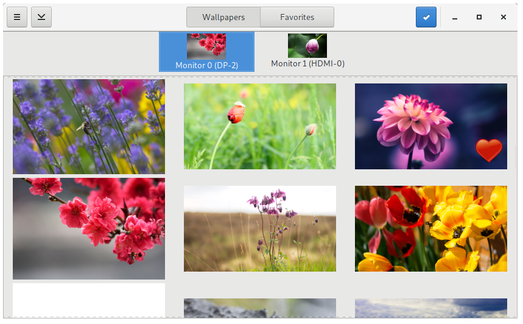

# HydraPaper

A Gtk utility to set two different backgrounds for each monitor on GNOME (which lacks this feature)



## Requirements

This tool requires `python-pillow` and `python-xmltodict`.

## Installing

### Installing on Arch Linux/Antergos/Manjaro

You can find HydraPaper on AUR, as `hydrapaper-git` ([AUR page](https://aur.archlinux.org/packages/hydrapaper-git)).

### Installing via Flatpak

- Make sure you have flatpak installed in your system ([here is a tutorial on how to install it](https://flatpak.org/getting.html)), and make sure that the version is >= 0.10 (check it using this command: `flatpak --version`)
- Add the [flathub](https://flathub.org) repository using the following command: `flatpak remote-add --if-not-exists flathub https://dl.flathub.org/repo/flathub.flatpakrepo`. This is needed for flatpak to download the GNOME 3.26 Runtime
- Download the latest flatpak release [from the releases page](https://github.com/GabMus/HydraPaper/releases)
- Install the flatpak file you just downloaded either opening it up with GNOME Software or using one of the following commands:
  - To install HydraPaper systemwide: `flatpak install hydrapaper*.flatpak`
  - To install HydraPaper locally for your user only: `flatpak --user install hydrapaper*.flatpak`

#### Using development builds

For every change made to HydraPaper there will be a flatpak. If you want to try out the latest features and don't mind some bugs or crashes here and there, or if you want to help out with development, you can grab the latest development snapshot build using the link below.

**[Get the latest development snapshot](https://gabmus.gitbub.io/HydraPaper)**

#### Uninstalling HydraPaper flatpak

You can uninstall HydraPaper from GNOME Software.

Alternatively you can run one of these commands:

- If you installed HydraPaper using GNOME Software or systemwide: `flatpak uninstall org.gabmus.hydrapaper`
- If you installed HydraPaper locally for your user only: `flatpak --user uninstall org.gabmus.hydrapaper`

### Other distros

Your best bet is installing via Flatpak. [Check the instructions in this section](#installing-via-flatpak).

Alternatively ou can either run HydraPaper without installing it (refer to the [Building for testing section](#building-for-testing)), or install it in your system (refer to the [Installing systemwide directly section](#build-and-install-systemwide-directly)).

## Building

### Building for testing

This is the best practice to test HydraPaper without installing using meson and ninja.

#### First time

```bash
git clone https://github.com/gabmus/hydrapaper
cd hydrapaper
mkdir builddir
cd builddir
meson ..
meson configure -Dprefix=$(pwd)/testdir
ninja install # This will actually install in hydrapaper/builddir/testdir
ninja run
```

#### Later on

```bash
cd hydrapaper/builddir
ninja install # This will actually install in hydrapaper/builddir/testdir
ninja run
```

### Building for Flatpak

First install `flatpak` and `flatpak-builder` from your distro repository. Although it's not necessary, you may also want to install `gnome-software`.

Create a directory somewhere in your home, I suggest something like `~/hydrapaperflatpak`.

Either clone the whole HydraPaper repo (`git clone https://github.com/gabmus/hydrapaper`) or just download the flatpak manifest file from this repo in `dist/flatpak/org.gabmus.hydrapaper.json`. In either case, put the files inside the directory you created before.

Run the following: `flatpak-builder --repo=repo hydrapaper $PATH_TO_MANIFEST` where `$PATH_TO_MANIFEST` is the path to the `org.gabmus.hydrapaper.json` flatpak manifest. If everything works correctly, this command should create two directories `repo` and `hydrapaper` with flatpak stuff inside of your present working directory (again, I suggest to run everything inside a specifically designated directory).

Now you'll be creating a flatpak bundle, so that you can install it and distribute it without messing with flatpak repos. To do this you run `flatpak build-bundle repo hydrapaper.flatpak org.gabmus.hydrapaper`. This will give you a hydrapaper.flatpak file inside your present working directory. To install it, either open it with `gnome-software` or run `flatpak install hydrapaper.flatpak`.

*Note: I am a just a beginner with flatpak, and probably some of the instructions I gave in this section of the readme are wrong or could be done better. If you know a better way of doing this, please don't hesitate to make a pull request or open an issue.*

### Build and install systemwide directly

This approach is discouraged, since it will manually copy all the files in your system. **Uninstalling could be difficult and/or dangerous**.

But if you know what you're doing, here you go:

```bash
git clone https://github.com/gabmus/hydrapaper
cd hydrapaper
mkdir builddir
cd builddir
meson ..
ninja install
```
